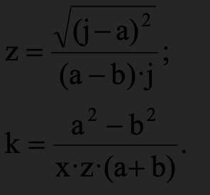

# eo_labs
## What this repository is for?
With a help of this repository you will get familiar with EO programming.  
Moreover, this repository has the documentation on the language and its standard library. 

## Table of Contents
- [What this repository is for?](#what-this-repository-is-for)
- [Table of Contents](#table-of-contents)
- [Introduction to the enviroment](#introduction-to-the-enviroment)
  - [Analysis of the EO Concept and the Eo language](#analysis-of-the-eo-concept-and-the-eo-language)
  - [Eolang Object-Oriented Programming Principles](#eolang-object-oriented-programming-principles)
  - [Comparison of OOP principles with Java,Groovy,Kotlin](#comparison-of-oop-principles-with-java-groovy-kotlin)
  - [Comparison of operators and expressions](#comparison-of-operators-and-expressions)
  - [Setting up an enviroment](#setting-up-an-enviroment)
  - [Hello world!](#hello-world)
  - [Control questions](#control-questions)
- [First mathemetical operations](#first-mathemetical-operations)
  - [Theoretical materials for operations](#theoretical-materials-for-operations)
  - [Self-practice](#self-practice-1)
  - [Control questions](#control-questions-1)
- [How to work with arrays](#how-to-work-with-arrays)
  - [Theoretical materials for arrays](#theoretical-materials-for-arrays)
  - [Self-practice](#self-practice-2)
  - [Control questions](#control-questions-2)
- [What are the data type objects in EO](#what-are-the-data-type-objects-in-EO)
  - [Theoretical materials for data type objects](#theoretical-materials-for-data-type-objects)
  - [Self-practice](#self-practice-3)
  - [Control questions](#control-questions-3)
- [Language mechanisms that exist](#language-mechanisms-that-exist)
  - [Theoretical materials for language mechanisms](#theoretical-materials-for-language-mechanisms)
  - [Self-practice](#self-practice-4)
  - [Control questions](#control-questions-4)
- [How to add new data type objects](#how-to-add-new-data-type-objects)
  - [Theoretical materials for creating new objects in EO](#theoretical-materials-for-creating-new-objects)
  - [Self-practice](#self-practice-5)
  - [Control questions](#control-questions-5)
- [Final project](#final-project)
- [Final test](#final-test)

- [The EO Programming Language Reference](#the-eo-programming-language-reference)
  - [Objects](#objects)
  - [Attributes](#attributes)
    - [Free & Bound Attributes. Binding](#free--bound-attributes-binding)
    - [Accessing Attributes. The Dot Notation](#accessing-attributes-the-dot-notation)
    - [The `@` attribute](#the--attribute)
    - [The `$` attribute](#the--attribute-1)
    - [The `^` attribute](#the--attribute-2)
  - [Abstraction](#abstraction)
  - [Application](#application)
  - [Decoration](#decoration)
  - [Dataization](#dataization)
    - [`!` — Dataize Only Once](#--dataize-only-once)
- [The EO Standard Object Collection](#the-eo-standard-object-collection)
  - [Data Type Objects](#data-type-objects)
    - [`bool` Data Type Object](#bool-data-type-object)
      - [Syntax](#syntax)
      - [`if` Attribute](#if-attribute)
      - [`not` Attribute](#not-attribute)
      - [`and` Attribute](#and-attribute)
      - [`or` Attribute](#or-attribute)
      - [`while` Attribute](#while-attribute)
    - [`float` Data Type Object](#float-data-type-object)
      - [Syntax](#syntax-1)
      - [`eq` Attribute](#eq-attribute)
    - [`string` Data Type Object](#string-data-type-object)
      - [Syntax](#syntax-2)
      - [`eq` Attribute](#eq-attribute-1)
      - [`trim` Attribute](#trim-attribute)
      - [`toInt` Attribute](#toint-attribute)
    - [`int` Data Type Object](#int-data-type-object)
      - [Syntax](#syntax-3)
      - [`eq` Attribute](#eq-attribute-2)
      - [`less` Attribute](#less-attribute)
      - [`add` Attribute](#add-attribute)
      - [`sub` Attribute](#sub-attribute)
      - [`neg` Attribute](#neg-attribute)
      - [`mul` Attribute](#mul-attribute)
      - [`div` Attribute](#div-attribute)
      - [`mod` Attribute](#mod-attribute)
      - [`pow` Attribute](#pow-attribute)
    - [`char` Data Type Object](#char-data-type-object)
      - [Syntax](#syntax-4)
  - [Command Line Interface Output](#command-line-interface-output)
    - [Plain Text Output. `stdout`](#plain-text-output-stdout)
    - [Formatting Strings. `sprintf`](#formatting-strings-sprintf)
  - [Random Number Generation. `random`](#random-number-generation-random)
  - [Arrays](#arrays)
    - [`get` Attribute](#get-attribute)
    - [`append` Attribute](#append-attribute)
    - [`reduce` Attribute](#reduce-attribute)
    - [`map` Attribute](#map-attribute)
    - [`mapi` Attribute](#mapi-attribute)
  - [Sequencing Computations. `seq`](#sequencing-computations-seq)
  - [Mutable Storage in Memory. `memory`](#mutable-storage-in-memory-memory)
- [How to Contribute](#how-to-contribute)


## Introduction to the enviroment
Object Oriented Programming (OOP) has been the dominant paradigm in the software development industry over the past decades. OOP languages, including well-known languages such as Java, C++, C# and Python, are widely used by major technology companies, software developers, and leading providers of digital products and solutions for various projects. It should be noted that virtually all key programming languages are essentially focused on supporting multiparadigm style, which allows for different style of coding in a single software project. The absence of restrictions on programming style often leads to the use of not the most reliable coding techniques, which greatly affects the reliability of programs in several areas. The existing attempts to limit the programming style, by directives, do not always lead to the desired result. In addition, supporting different programming paradigms complicates languages and tools, reducing their reliability. Moreover, the versatility of these tools is not always required everywhere. Often many programs can be developed using only the OOP paradigm.

Furthermore, among language designs considered OOP, there are those that reduce the reliability of the code being developed. Therefore, the actual problem is the development of such OOP languages that provide higher reliability of programs. This is especially true for a number of critical areas of their application.
A lot of teams and companies that use these languages suffer from the lack of quality of their projects despite the tremendous effort and resources that have been invested in their development. Many discussions concerning code quality issues appeared in the field. Mainly these focused on eliminating code smells and introducing best practices and design patterns into the process of software development. As many industry experts point out, the reason for project quality and maintainability issues might be explained by the essence of inherent flaws in the design of the programming language and the OOP paradigm itself, and not the incompetence or lack of proper care and attention of the developers involved in the coding solely [3]. Thus, it is necessary to develop new programming languages and approaches for implementing solutions in the OOP paradigm are to be developed. Some programming languages emerged based on the Java Virtual Machine to address this claim and solve the design weaknesses of Java for the sake of better quality of produced solutions based on them. These are Groovy, Scala, and Kotlin, to name a few. While many ideas these languages proposed were widely adopted by the community of developers, which led to their incorporation into the mainstream languages, some were considered rather impractical and idealistic. Nevertheless, such enthusiastic initiatives drive the whole OOP community towards better and simpler coding.

The EO programming language is an object-oriented language that is being developed as an R&D solution, the purpose of which is to show that industrial programming in the pure OOP paradigm [6] is possible. The language is being developed by Huawei's “Code Quality Foundation” [laboratory](https://github.com/cqfn). The language is based on the philosophy “Elegant Objects” and a fundamentally new formal model of ɸ-calculus, which defines basic operations on objects, positioned as necessary and sufficient to achieve object-oriented properties of the language.
In total, the model contains four basic operations: abstraction (definition of fundamentally new concept objects), application (application of abstract objects to specific cases of their use), decoration (hierarchical composition of objects), and datarization (calculation of objects or otherwise: obtaining data that the object abstracts) ... 


### Analysis of the EO Concept and the Eo language
Eolang is an object-oriented programming language aimed at realizing the pure concept of object-oriented programming, in which all components of a program are objects. Eolang's main goal is to prove that fully object-oriented programming is possible not only in books and abstract examples but also in real program code aimed at solving practical problems. The EO concept departs from many of the constructs typical of classical object-oriented languages such as Java [1]:
1. Static classes and methods are a popular approach to implementing utility classes in languages such as Java, C #, Ruby. In OOP methodology, this approach is considered bad practice, since they do not allow creating objects, therefore, they are not part of the OOP paradigm. Such classes are a legacy of the procedural programming paradigm. Following the principles of OOP, developers should provide the ability for objects to manipulate data when necessary, and the implementation of the logic for working with data should be hidden from external influences.
2.Classes are templates and behavior of objects. The Elegant Object concept refuses to use classes in favor of types that define the behavior of objects. Each object inherits from its type only its methods, while objects of the same type can have different internal structures [7].
3. Implementation inheritance. EO does not allow inheriting the characteristics of objects, explaining that this approach turns objects into containers with data and procedures. The Eolang language developers consider inheritance to be a bad practice, as it comes from a procedural programming methodology for code reuse. Instead of inheriting implementation, the EO concept suggests creating subtypes that extend the capabilities
of objects.
4. Variability. In OOP, an object is immutable if its state cannot be modified after it has
been created. An example of such an object in Java would be String. We can request the creation of new rows, but we cannot change the state of existing ones. Immutable objects have several advantages:
- Immutable objects are easier to create, test, and use.
- Immutable objects can be used in several threads at the same time without the risk that some thread can change the object, which can break the logic of other threads.
- The usage of immutable objects avoids side effects.
- Immutable objects avoid the problem of changing identity.
- Immutable objects prevent NULL references.
- Immutable objects are easier to cache [8].
5. NULL. Using a NULL reference is against the concept of OOP since NULL is not an object. NULL is a null reference; a null pointer is 0x00000000 in x86 architecture. NULL references complicate the program code, as they create the need to constantly check the input data for Null. If the developer forgot to do this, there is always the risk of the application crashing with a NullPointerException. In EO, there are two approaches to creating an alternative to NULL - Null Object - an object without any properties with neutral behaviour, and throwing an exception if the object cannot be returned.
6. Global variables and functions. In OOP methodology, objects must manipulate data, and their implementation must be hidden from outside influence. In Eolang, objects created in the global scope are assigned to the attributes of the system object, the highest level of abstraction.
7. Reflection - the ability of the running application to manipulate the internal properties of the program itself.
8. Typecasting - Allows you to work with the provided objects in different ways based on the class they belong to.:
9. Primitive data types. The EO concept does not imply primitive data types, since they are not objects, which is contrary to the OOP concept.
10.Annotations. The main problem with annotations is that they force developers to implement the functionality of the object outside the object, which is contrary to the principle of encapsulation in OOP [9].
11. Unchecked exceptions. Unchecked exceptions hide the fact that the method might fail. The EO concept assumes that this fact must be clear and visible. When a method performs too many different functions, there are so many points at which an error can occur. The method should not throw exceptions in as many situations as possible. Such methods should be decomposed into many simpler methods, each of which can only
throw 1 type of exception.
12. Operators. There are no operators like +, -, *, / in EO. Numeric objects have built-in
functions that represent mathematical operations. The creator of EO considers operators
to be "syntactic sugar".
13. Flow control operators (for, while, if, etc.).
14. Syntactic sugar". The EO concept assumes the use of strict and precise syntax. Syntactic
sugar can reduce the readability of your code and make it harder to understand.


3. Rejection of inheritance as a composition operation.
EO does not allow the inheritance of the attributes of objects, explaining that this approach turns objects into containers with data and procedures. Eolang developers consider inheritance to be bad practice because it comes from procedural programming methodology for code reuse. Instead of inheriting implementation, the EO concept suggests creating subtypes that extend the capabilities of objects.


4. Immutability of objects and their fields.
In OOP, an object is immutable if its state cannot be changed after
was created. An example of such an object in Java would be a sequence. We can request the creation of new lines, but we are not
we can change the state of existing ones. Immutable objects have several advantages:
• Immutable objects are easier to create, test, and use.
• Immutable objects can be used in multiple threads at the same time without the risk of any thread changing the object, which could break the logic of other threads.
• Using immutable objects avoids side effects.
• Immutable objects avoid the problem of changing identity.
• Immutable objects disallow NULL references.
• Immutable objects are easier to cache.


5. Avoiding null references.
 Using null references is against the concept of OOPand since null is not an object. Null is a null link; a null pointer is 0x00000000 on x86 architecture. Null references add complexity to your code because you need to constantly check input data for null. If the developer forgot to do this, there is always a risk of the application crashing (NullPointerException).
There is a null alternative approach in EO:
Null Object - an object without any properties with neutral behavior and throwing an exception if the object cannot be returned.

6. Refusal from global variables and procedures.
In OOP methodology, objects must manipulate data, and their implementation must be hidden from outside influence. In Eolang, objects created in the global scope are assigned to the attributes of the system object, the highest level of abstraction.


 7. Refusal of reflection.
 That is, the ability of the running application to manipulate
 internal properties of the program itself.


 8. Avoiding explicit type conversion.
 Ability to work with provided objects in different ways depending on the class to which they belong.


 9. Lack of primitive data types.
 The EO concept does not imply primitive data types as they are not objects, which is contrary to the OOP concept.


 10. Rejection of the annotating code.
 The main problem with annotations is that they force
 developers to implement the functionality of the object outside the object, which is contrary to the principle of encapsulation in OOP.

### Eolang Object-Oriented Programming Principles
 
Abstraction - in Eolang, objects are elements into which the subject area is decomposed. According to West: “Objects, as abstractions of real-world entities, are dense and integral clusters of information.

Inheritance – Implementation inheritance does not exist in Eolang, as such inheritance constrains the structure and behavior of superclasses and can lead to subsequent development difficulties. Also, changes in the superclass can lead to unexpected results in the derived classes. In Eolang, inheritance is implemented through an object hierarchy and can be created using decorators. Objects in Eolang inherit only behavior, while they cannot override it, but only add new functionality.

Polymorphism. There are no explicitly defined types in Eolang, the correspondence between objects is made and checked at compile time. Eolang always knows when objects are created or copied, as well as their structure. By having this information at compile-time, you can guarantee a high level of compatibility among their users' objects. 

Encapsulation. The inability to make the encapsulation barrier explicit is the main reason why Eolang does not hide information about the object structure. All attributes of an object are visible to any other object. In Eolang, the main goal of encapsulation - reducing the interconnectedness between objects - is achieved in a different way. In Eolang, the density of the relationship between objects is controlled at the assembly stage. At compile time, the compiler collects information about the relationships between objects and calculates the depth for each relationship.

### Comparison of OOP principles with Java,Groovy,Kotlin

<table border="2" align="center" width="50%" cellspacing="0">
	<tr>
		<th>Principle</th>
		<th>EO</th>
		<th>Java</th>
    <th>Groovy</th>
    <th>Kotlin</th>
	</tr>
	<tr>
    <td align="center">Abstraction</td>
		<td align="center">Exists as the operation of
declaring a new
object by making
a copy of another
object</td>
		<td align="center">Exist as a class declared with the “abstract” keyword</td>
    <td align="center">Exist as a class declared with the “abstract” keyword</td>
		<td align="center">Like Java, abstract keyword is used to declare abstract classes in Kotlin</td>
	</tr>
  	<tr>
    <td align="center">Encapsulation</td>
		<td align="center">Does not exist
And will not be introduced. All attributes are publicly
available to every object</td>
		<td align="center">Data/variables are hidden and can be access through getter and setter methods</td>
    <td align="center">In Groovy, everything is public. There is no idea
of private fields or methods, unlike Java</td>
		<td align="center">Encapsulation exists in kotlin, just like Java. The private, public and protected keywords are used to set view encapsulation</td>
  	<tr>
    <td align="center">Inheritance</td>
		<td align="center">Does not exist
And will not be introduced
The usual inheritance is presented by decorators (@)</td>
		<td align="center">Uses extends keyword to inherit properties of a parent class (superclass)</td>
    <td align="center">Uses extends keyword to inherit properties of a parent class (superclass)</td>
		<td align="center">By default, Kotlin classes are final: they can’t be inherited.
To make a class inheritable, mark it with the open keyword</td>
	</tr>
	</tr>
  	<tr>
    <td align="center">Polymorphism</td>
		<td align="center">Does not exist
Will be implemented (Ad hoc polymorphism)</td>
		<td align="center">Java provides compile time and runtime polymorphisms</td>
    <td align="center">In Groovy, the type of the object is considered at runtime, not the type
of the reference so the method is found at runtime</td>
		<td align="center">Kotlin supports two forms of polymorphisms in Java</td>
	</tr>
  </tr>
  	<tr>
    <td align="center">Data types</td>
		<td align="center">Presented as Atom Data Type Objects
Atom is an of acronym "Access to Memory.</td>
		<td align="center">Provides both primitive and non- primitive data types</td>
    <td align="center">In Groovy supports the same number of primitive types as Java</td>
		<td align="center">Kotlin’s basic data types includes Java primitive data types</td>
	</tr>
</table>

### Comparison of operators and expressions

<table border="2" align="center" width="50%" cellspacing="0">
<tr>
		<th>Scope resolution</th>
		<th>EO</th>
		<th>Java</th>
    		<th>Groovy</th>
    		<th>Kotlin</th>
	</tr>
<tr>
    <td align="center">Parenthesis</td>
		<td align="center">()</td>
		<td align="center">()</td>
    		<td align="center">()</td>
		<td align="center">()</td>
	</tr>
	
<tr>
    <td align="center">Access via object</td>
		<td align="center">.</td>
		<td align="center">.</td>
    		<td align="center">.</td>
		<td align="center">.,?.</td>
	</tr>
<tr>
    <td align="center">Post Increment</td>
		<td align="center"> </td>
		<td align="center">++</td>
    		<td align="center">++</td>
		<td align="center">++</td>
	</tr>
<tr>
    <td align="center">Post decrement</td>
		<td align="center"> </td>
		<td align="center">--</td>
    		<td align="center">--</td>
		<td align="center">--</td>
	</tr>
<tr>
    <td align="center">Unary minus</td>
		<td align="center">.neg</td>
		<td align="center">-</td>
    		<td align="center">-</td>
		<td align="center">-</td>
	</tr>
<tr>
    <td align="center">Creating object</td>
		<td align="center"> > </td>
		<td align="center">new</td>
    		<td align="center">new</td>
		<td align="center"> </td>
	</tr>
<tr>
    <td align="center">Multiplicative</td>
		<td align="center">.mul,.div,.mod</td>
		<td align="center">*,/,%</td>
    		<td align="center">*,/,%</td>
		<td align="center">*,/,%</td>
	</tr>
<tr>
    <td align="center">Additive</td>
		<td align="center">.add,.sub</td>
		<td align="center">+,-</td>
    		<td align="center"> </td>
		<td align="center"> </td>
	</tr>
<tr>
    <td align="center">Equality</td>
		<td align="center">.eq,.not</td>
		<td align="center">==,!=</td>
    		<td align="center">==,!=,===,!==</td>
		<td align="center">==,!=,===,!==</td>
	</tr>
<tr>
    <td align="center">Logical not</td>
		<td align="center">.not</td>
		<td align="center">!</td>
    		<td align="center">!</td>
		<td align="center">!</td>
	</tr>
<tr>
    <td align="center">Relational</td>
		<td align="center">.less</td>
		<td align="center"><,<=,>,>=</td>
    		<td align="center"><,<=,>,>=</td>
		<td align="center"><,<=,>,>=</td>
	</tr>
<tr>
    <td align="center">Logical AND</td>
		<td align="center">.and</td>
		<td align="center">&&</td>
    		<td align="center">&&</td>
		<td align="center"> </td>
	</tr>
<tr>
    <td align="center">Logical OR</td>
		<td align="center">.or</td>
		<td align="center">||</td>
    		<td align="center">||</td>
		<td align="center">||</td>
	</tr>	
<tr>
    <td align="center">Assignment</td>
		<td align="center">></td>
		<td align="center">=</td>
    		<td align="center">=</td>
		<td align="center">=</td>
	</tr>	
</table>

### Setting up an enviroment

First, clone [this](https://github.com/cqfn/eo) repo to your local machine and go
to the `eo` directory (you will need
[Git](https://git-scm.com/book/en/v2/Getting-Started-Installing-Git)
installed):

```bash
$ git clone https://github.com/cqfn/eo.git
$ cd eo
```
Second, compile the transpiler and the runtime of the EO programming language (you will need
[Maven 3.3+](https://maven.apache.org/)
and [Java SDK 8+](https://www.java.com/en/download/) installed):  
```bash
$ mvn clean install
```  
*You need to run the above command only once. This will install the runtime & the transpiler to your machine.*  
Then, compile the code of the sandbox:
```bash
$ cd sandbox/hse
$ mvn clean compile
```  
Intermediary `*.xml` files will be generated in the `target` directory (it will
be created). Also, there will be `*.java` and `*.class` files. Feel free to analyze
them: EO is parsed into XML, then translated to Java, and then compiled
by Java SDK to Java bytecode. Finally, just run the bytecode program through JRE. For example, to run the Fibonacci example, do the following:  

```bash
$ ./run.sh appFibonacci 9
The program has dataized to: 9th Fibonacci number is 34


real	0m0.177s
user	0m0.175s
sys	0m0.037s

```  
The first argument of `./run.sh` is the name of the object to be dataized, while all the other arguments are passed to that object as its free attributes.  

### Hello world!
Create new file lab1`*.eo` in sandbox folder, and enter the code below:
```bash
+alias stdout org.eolang.io.stdout

[] > lab1
  stdout > @
    "Hello, world!"

``` 

It is *important* to remember that each EO program must be ended with a new line without any symbols.

Compile and run your program as it was [shown](#setting-up-an-enviroment).

### Control questions
- What are the main differences between EO and Java?
- What are the main differences between EO and Kotlin?
- What are the main differences between EO and Groovy?
- What are the core EO principles?
#TODO

## First mathemetical operations

At first, to be able to produce mathematical programs in EO, it is *important* to examine the theoretical material from the [EO Reference](#the-eo-programming-language-reference).

### Theoretical materials for operations
Key materials for this section are:
- [Objects](#objects)
- [Attributes](#attributes)
- [`int` Data Type Object](#int-data-type-object)
- [Command Line Interface Output](#command-line-interface-output)

The [example](https://www.eolang.org/eolang-paper.pdf) bellow shows 2 programs(In Java and EO) that determine whether the year, provided by the user as console input, is leap or not. 
```bash
import java.util.Scanner;
 public class LeapYear {
   public static void main(String[] args) {
     Scanner input = new Scanner(System.in);
     System.out.print("Enter a year: ");
     int year = input.nextInt();
     boolean isLeapYear =
       (year % 4 == 0 && year % 100 != 0) ||
       (year % 400 == 0);
     System.out.println(year +
       " is a leap year? " + isLeapYear);
} }
``` 
The same functionality would require the following code in EO:
```bash
+alias org.eolang.*
 +alias org.eolang.io.stdout
 +alias org.eolang.io.stdin
 +alias org.eolang.txt.scanner

[args] > main
  seq > @
    stdout
   "Enter a year:"
 stdout
   concat
     scanner > year
       stdin
     .nextInt
     " is a leap year?"
     or.
       and.
         eq. (mod. year 4) 0
         not. (eq. (mod. year 100) 0)
       eq. (mod. year 400) 0
``` 

### Self-practice

#### Task1
Given H, M.
Define:


#### Task2
Given A,B,K.
Define:


#### Task3
Given K, L.
Define:


#### Task4
Given a,b,j,x.
Define:



#### Task5
Given a,b,N.
Define:


### Control questions
#TODO

## How to work with arrays
In order to get all the important reference material connected with arrays in EO check the [EO Reference](#the-eo-programming-language-reference).

### Theoretical materials for arrays

Key materials for this section are:
- [Arrays](#arrays)
- [Objects](#objects)
- [Attributes](#attributes)
- [`int` Data Type Object](#int-data-type-object)
- [Command Line Interface Output](#command-line-interface-output)

### Self-practice
#TODO

### Control questions
#TODO


## The EO Programming Language Reference
This section covers the basic principles that the EO programming language relies on. These are objects, attributes, and four elemental operations — abstraction, application, decoration, and dataization.
### Objects
**Objects** are a centric notion of the EO programming language. Essentially, an **object** is a set of *attributes*. An object connects with and links other objects through its attributes to compose a new concept that the object abstracts.  
An **abstract object** is an object that has at least one [free attribute](#free--bound-attributes-binding).  
This is an example of an abstract object:  
```
[a b] > sum
  a.add b > @
  a > leftOperand
  b > rightOperand
```  
A **closed object** is an object whose all attributes are [bound](#free--bound-attributes-binding).  
These are examples of closed objects:  
```
# Application can turn an abstract object to a closed one
sum 2 5 > closedCopyOfSum
# Abstraction can declare closed objects
[] > zero
  0 > @
  "0" > stringValue
  # Closed objects may have abstract attributes
  [x] > add
    sum 0 x > @ 
  # And closed attributes, too
  [] > neg
    -0 > @
  $.add 1 > addOne
```  
### Attributes
An **attribute** is a pair of a name and a value, where a value of an attribute is another object. That is because `"Everything in EO is an object"`. Hence, for instance, an attribute `name` of an object `person` may be also referred to as plainly the object `name` of the object `person`.  
#### Free & Bound Attributes. Binding
**Binding** is an operation of associating an attribute's value with some object. An attribute may be bound to some object only once.  
An attribute that is not bound to any object is named a **free attribute**. An attribute that has some object associated with its value is called a **bound attribute**.  
*Free attributes* may be declared through the object [abstraction](#abstraction) only.
*Binding* may be performed either during object declaration using the bind (`>`) operator (see the [abstraction](#abstraction) section for more information) or through object copying (see the [application](#application) section for details).
#### Accessing Attributes. The Dot Notation
There are no access modifiers in the EO programming language. All attributes of all objects are publicly visible and accessible. To access attributes of objects, the dot notation is used. The dot notation can be used to retrieve values of attributes and not to bind attributes with objects.   
##### Example. The Horizontal Dot Notation <!-- omit in toc -->
```
(5.add 7).mul 10 > calc
```
##### Example. The Vertical Dot Notation <!-- omit in toc -->
```
mul. > calc
  add.
    5
    7
  10
```
Here, `add` is an attribute of the object `5` and `mul` is an attribute of the attribute object `add` (or, more precisely, an attribute of an object that `add` abstracts or dataizes to, which is an integer number `int`). 
#### The `@` attribute
The `@` attribute is named `phi` (after the Greek letter `φ`). The `@` character is reserved for the `phi` attribute and cannot be used for any other purpose. Every object has its own and only `@` attribute. The `@` attribute can be bound to a value only once.    
The `@` attribute is used for decorating objects. An object bound to the `@` attribute is referred to as a decoratee (i.e., an object that is being decorated) while the base object of the `@` attribute is a decorator (i.e., an object that decorates the decoratee). Since the `@` attribute may be bound only once, every object may have only one decoratee object. More on the decoration see in [this section](#decoration).    
Besides, the `@` attribute is heavily used in the dataization process (see [this section](#dataization) for more information). 
#### The `$` attribute
The `$` character is reserved for the special attribute `self` that every object has. The `$` attribute is used to refer to the object itself.  
The `$` attribute may be useful to use the result of the object's dataization process for declaring other object's attributes.  
The `$` attribute may be used to access attributes of an object inside of the object with the dot notation (e.g., `$.attrA`), but this notation is redundant.  
#### The `^` attribute
The `^` attribute is used to refer to the parent object.  
The `^` attribute may be used to access attributes of a parent object inside of the current object with the dot notation (e.g., `^.attrA`). 
##### Example <!-- omit in toc -->
```
[] > parentObject
  42 > magicNumbe
  [] > childObject
    24 > magicNumber
    add. > @
      ^.magicNumber # refers to the parent object's attr
      magicNumber # refers to $.magicNumber
``` 
### Abstraction
**Abstraction** is the operation of declaring a new object. Abstraction allows declaring both abstract and closed, anonymous and named objects.  
If we are to compare abstraction and application, we can conclude that **abstraction** allows broadening the field of concepts (objects) by declaring new objects. *Application* allows enriching the objects declared through *abstraction* by defining the actual links between the concepts. 
#### Syntax <!-- omit in toc -->
The abstraction syntax includes the following elements:  
1. *(optional)* One or more comment lines before (e.g., `# comment`).
2. A sequence of free attributes in square brackets. The sequence may be:
   1. Empty (`[]`). In this case, the declared object has no free attributes.  
   2. Containing one or more attribute names (`[a]` or `[a b c d e]`). In this case, the listed attribute names are the free attributes of the declared object.  
   3. Containing a variable-length attribute (`[animals...]`). The attribute must be at the end of the list of attributes to work properly. Internally, this attribute is represented by the `array` object.
3. *(optional)* Binding to a name (` > myObject`). Declared objects may be anonymous. However, anonymous objects must be used in application only (i.e., we can only supply anonymous objects for binding them to free attributes during application).  
4. *(optional)* The object may be declared as constant (i.e., dataized only once (see [this section](#--dataize-only-once))), if the object is bound to a name (see #3). For this, the `!` operator is used.  
5. *(optional)* The object may be declared as an atom (i.e., its implementation is made out of the EO language (for instance, in Java)) if the object is bound to a name (see #3). For this, the `/` operator is used (for example, `/bool`).  
#### Anonymous Abstraction <!-- omit in toc -->
There are two types of anonymous abstraction: inline and plain multi-line.  
**Plain Multi-line Anonymous Abstraction**   
```
[a b]
  a.add b > @
```
The same can be expressed in just one line.  
**Inline Anonymous Abstraction**  
```
[a b] a.add b
```  
**EBNF**  
```EBNF
abstraction ::= ( COMMENT '^' )*
               '[' ( attribute ( ' ' attribute )* )? ']'
                ( (' ' '>' ' ' label '!'?) ( ' ' '/' NAME )? )?
            
attribute ::= label
label ::= '@' | NAME '...'?
NAME ::= [a-z][a-z0-9_A-Z]*
```
**Railroad Diagram**  
  
#### Examples <!-- omit in toc -->
```
# no free attributes abstraction
[] > magicalObject
  # here we use application to define an attribute
  42 > magicalNumber

  # and here we use abstraction to define an attribute
  [a] > addSomeMagic
    # application again
    magicalNumber.add a > @

# variable-length attribute abstraction
[a b c args...] > app
  # the next five lines are examples of application
  stdout > @
    sprintf
      "\n%d\n%d\n"
      args.get 0
      magicalObject.magicalNumber.add a

# anonymous abstraction
[args...] > app
  reduce. > sum
    args
    0
    [accumulator current] # <--- this is anonymous abstraction
      add. > @
        accumulator
        current.toInt

# inline anonymous abstraction
[args...] > app
  reduce. > sum
    args
    0
    # inline anonymous abstraction
    [accumulator current] accumulator.add (current.toInt)
``` 
### Application
**Application** is the operation of copying an object previously declared with abstraction optionally binding all or part of its free attributes to some objects.  
If we are to compare abstraction and application, we can conclude that *abstraction* allows broadening the field of concepts (objects) by declaring new objects. **Application** produces more concrete and specific copies of objects declared through *abstraction* by defining the actual links between the concepts by binding their free attributes. 
#### Syntax <!-- omit in toc -->
The application syntax is quite wide, so let's point out the constituents to perform the application:  
1. An object being applied/copied.
   1. It may be any existing (i.e., previously declared) object of any form — abstract, closed, anonymous, or named.
   2. It may be also an attribute object. In this case, both horizontal and vertical [dot notations](#accessing-attributes-the-dot-notation) can be used to access that attribute object.
2. A sequence of objects to bind to the free attributes of the applied object. The sequence may be placed in-line (horizontally) or vertically, one indentation level deeper relatively the copied object level. The sequence may be:
   1. Empty. In this case, the applied object will stay abstract or closed, as it was before.  
   2. Containing one or more objects. In this case, the listed objects will be bound to the free attributes of the applied object in their order of appearance.  
   3. Containing one or more objects with names after each (like `1:a 5:b 9:c`). In this case, the listed objects will be bound to the corresponding free attributes of the applied object.
3. *(optional)* Binding to a name (` > myObject`).  
4. *(optional)* The copied object may be declared as constant (i.e., dataized only once (see [this section](#--dataize-only-once))), if the object is bound to a name (see #3). For this, the `!` operator is used.    
#### Partial Application <!-- omit in toc -->
**This implementation of the EO programming language DOES NOT support partial application yet. It was one of the design desicion made. However, it might change in future!**  

Essentially, application is used to bind free attributes of abstract objects to make their concrete and more specific copies. Application allows binding arbitrary number of free attributes, which can be used to partially apply objects.  
```
# abstract object
[a b] > sum
  a.add b > @

# we can partially apply it to create a new, more specific concept
sum 10 > addTen
# we can apply this copied object, too
addTen 10 > twenty
```
#### Examples <!-- omit in toc -->
```
# here application with no binding
42 > magicalNumber

# horizontal application of 
# the add attribute of the magicalNumber
magicalNumber.add 1 > secondMagicalNumber

# vertical application
# & application inside application
sub. > esotericNumericalEssence
  mul.
    add.
      magicalNumber
      22
    17
  10
``` 
### Decoration
**Decoration** is the operation of extending one object's (`the decoratee`) attributes with attributes of the other object (`the decorator`). Through decoration, the decorator fetches all the attributes of the decoratee and adds up new own attributes. Hence, the decorator represents the decoratee with some extension in the functionality.  
#### Syntax <!-- omit in toc -->  
The decorator's `@` attribute should be bound to the decoratee object in order to perform the decoration operation.  
The syntax for the decoration operation is as follows:  
```
[] > theDecorator
  theDecoratee > @
```
Here, `theDecorator` can access all the attributes of `theDecoratee` and use them to define its own attributes.
#### Example <!-- omit in toc -->
Say, we have the `purchase` object that represents a purchase of some item that has a name, cost, and quantity. The `purchaseTotal` decorates it and adds new functionality of calculating the total.
```
[itemName itemCost itemQuantity] > purchase
  itemName > @

[] > purchaseTotal
  purchase > @
  mul. > total
    @.itemCost
    @.itemQuantity
```
Now we can access all attributes of `purchase` and `purchaseTotal`  through a copy of `purchaseTotal`.
### Dataization
**Dataization** is the operation of evaluation of data laying behind an object. The dataization process (denoted hereby as `D(something)`) is recursive and consists of the following steps:  
1. `D(obj) = obj` if `obj` is a data object. Data objects are `int`, `float`, `string`, `char`, `bytes`.  
2. If the `obj` is an atom (atoms are objects that are implemented outside EO), then `D(obj)` is the data returned by the code behind the atom.  
3. Otherwise, `D(obj) = D(obj.@)`. That is, if the object is neither data nor an atom, then the object "asks" its decoratee to find the data behind it.  
  
It is important to note that if the `@` attribute of the object (or any underlying object in the dataization recursive evaluation tree) is absent (free), then the dataization will fail.  
If we want to dataize the object `x`, all objects and attributes that are used in the definition of the `@` attribute of the `x` will be dataized. Like this, if we want to dataize the attribute `x.attr`, all objects and attributes that are used in the definition of its `@` attribute will be dataized.  
The opposite is true. If the attribute `x.attr` or the object `x` itself are not used in the declaration of `y`, then `D(y)` will not dataize them and they will not be evaluated and executed. Thus, the dataization operation may be referred to as the lazy object evaluation (i.e., EO dataizes objects only when this is needed).    
#### `!` — Dataize Only Once
`not implemented`

## The EO Standard Object Collection
This section covers *The EO Standard Object Collection* which is a library of utility objects for writing programs in *EO*.  
### Data Type Objects  
*The EO Programming Language* and *The EO Standard Object Collection* defines these data type objects: `bool`, `int`, `float`, `string`, `char`. 
#### `bool` Data Type Object
The `bool` data type object represents a boolean value (either `true` or `false`) that can be used for performing logical operations.  
**Fully Qualified Name:** `org.org.eolang.bool` (no aliasing or FQN reference required since the object is automatically imported).  
##### Syntax
The `bool` data type object may be parsed by the EO compiler directly from the source code. The syntax rules for `bool` values are as follows.  
**EBNF Notation**  
```EBNF
BOOL     ::= 'true'
           | 'false'
```
**Railroad Diagram**  
  
###### Example <!-- omit in toc -->
```
+package sandbox
+alias sprintf org.org.eolang.txt.sprintf
+alias stdout org.org.eolang.io.stdout
[args...] > app
  stdout > @
    sprintf
      "%b\n%b\n"
      true
      false

```
**Running**   
```
IN$: ./run.sh
OUT>: true
OUT>: false
IN$: 
```
##### `if` Attribute
The `if` attribute object is used for value substitution based on a condition that can be evaluated as a `bool` object.  
The `if` attribute object has two free attributes:  
1. `t` for the substitution if the base `bool` object is `true`.  
2. `f` for the substitution if the base `bool` object is `false`.  
  
If the `if` attribute object is fully applied, it represents the corresponding substitution value.   
###### Example <!-- omit in toc -->
```
+package sandbox
+alias sprintf org.org.eolang.txt.sprintf
+alias stdout org.org.eolang.io.stdout

[args...] > app
  stdout > @
    sprintf
      "%s\n%s\n%s\nThe max(2, 5) is: %d\n"
      true.if
        "the first value is true"
        "the first value is false"
      false.if
        "the second value is true"
        "the second value is false"
      if.
        2.less 3
        "2 is less than 3"
        "2 is not less than 3"
      (5.less 2).if
        2
        5

```
**Running**  
```
IN$: ./run.sh
OUT>: the first value is true
OUT>: the second value is false
OUT>: 2 is less than 3
OUT>: The max(2, 5) is: 5
IN$: 
```
##### `not` Attribute
The `not` attribute object represents a `bool` object with the inversed inner value of its base `bool` object.  
The `not` attribute object has no free attributes.  
###### Example <!-- omit in toc -->
In this example, all the answers from the previous example (the `if` attribute section) are inversed with the `not` attribute.  
```
+package sandbox
+alias sprintf org.org.eolang.txt.sprintf
+alias stdout org.org.eolang.io.stdout

[args...] > app
  stdout > @
    sprintf
      "[NOT Edition (all the answers are inversed with .not)]\n%s\n%s\n%s\nThe max(2, 5) is: %d\n"
      true.not.if
        "the first value is true"
        "the first value is false"
      false.not.if
        "the second value is true"
        "the second value is false"
      if.
        (2.less 3).not
        "2 is less than 3"
        "2 is not less than 3"
      (5.less 2).not.if
        2
        5

```
**Running**  
```
IN$: ./run.sh
OUT>: [NOT Edition (all the answers are inversed with .not)]
OUT>: the first value is false
OUT>: the second value is true
OUT>: 2 is not less than 3
OUT>: The max(2, 5) is: 2
IN$: 
```
##### `and` Attribute
The `and` attribute object represents logical conjunction on a variety of `bool` objects.  
The `and` attribute object has one free attribute `x` for the `bool` objects (conjuncts). `x` may be empty or may have any number of `bool` objects.  
  
If the `and` attribute object is applied, it represents the conjunction of the base `bool` object and all the objects bound to the `x` attribute.  
###### Example <!-- omit in toc -->
```
+package sandbox
+alias sprintf org.org.eolang.txt.sprintf
+alias stdout org.org.eolang.io.stdout

[args...] > app
  true > a
  true > b
  true > c
  false > d
  stdout > @
    sprintf
      "a && b = %b\na && b && c = %b\na && b && c && d = %b\n"
      a.and b
      a.and b c
      and.
        a
        b
        c
        d

```
**Running**  
```
IN$: ./run.sh
OUT>: a && b = true
OUT>: a && b && c = true
OUT>: a && b && c && d = false
IN$: 
```
##### `or` Attribute
The `or` attribute object represents logical disjunction on a variety of `bool` objects.  
The `or` attribute object has one free attribute `x` for the `bool` objects (disjuncts). `x` may be empty or may have any number of `bool` objects.  
  
If the `or` attribute object is applied, it represents the disjunction of the base `bool` object and all the objects bound to the `x` attribute.    
###### Example <!-- omit in toc -->
```
+package sandbox
+alias sprintf org.org.eolang.txt.sprintf
+alias stdout org.org.eolang.io.stdout

[args...] > app
  false > a
  false > b
  false > c
  true > d
  stdout > @
    sprintf
      "a || b = %b\na || b || c = %b\na || b || c || d = %b\n"
      a.or b
      a.or b c
      or.
        a
        b
        c
        d

```
**Running**  
```
IN$: ./run.sh
OUT>: a || b = false
OUT>: a || b || c = false
OUT>: a || b || c || d = true
IN$: 
```
##### `while` Attribute
**This implementation of the EO programming language DOES NOT support the bool.while standard attribute. This was the conceptual design decision that might change in future!**

The `while` attribute object is used to evaluate its `f` free attribute until the base `bool` object is not `false`.  
The `f` attribute object must have the free attribute `i` (the current iteration of the `while` loop).  
On dataization, the `while` attribute object evaluates to the number of iterations the loop took.  
Since objects are immutable, the `memory` object should be used as the loop condition (i.e., the base `bool` object of the `while` attribute). Moreover, the `memory` object should be changed somehow inside the `f`, otherwise the `while` will evaluate infinitely.
###### Example <!-- omit in toc -->
```
+package sandbox
+alias stdout org.org.eolang.io.stdout
+alias sprintf org.org.eolang.txt.sprintf

[args...] > app
  memory > x
  seq > @
    x.write 0
    while.
      x.less 11
      [i]
        seq > @
          stdout
            sprintf "%d x %d x %d = %d\n" x x i (x.mul (x.mul i))
          x.write (x.add 1)
```
Here, the `i` attribute of the `f` iteration object is used to find the `x^3`. However, the `i` attribute may stay unused inside the `f`.  
**Running**  
```
IN$: ./run.sh
OUT>: 0 x 0 x 0 = 0
OUT>: 1 x 1 x 1 = 1
OUT>: 2 x 2 x 2 = 8
OUT>: 3 x 3 x 3 = 27
OUT>: 4 x 4 x 4 = 64
OUT>: 5 x 5 x 5 = 125
OUT>: 6 x 6 x 6 = 216
OUT>: 7 x 7 x 7 = 343
OUT>: 8 x 8 x 8 = 512
OUT>: 9 x 9 x 9 = 729
OUT>: 10 x 10 x 10 = 1000
IN$: 
```
#### `float` Data Type Object
The `float` data type object represents a double-precision 64-bit IEEE 754 floating-point number and can be used to perform various `FPU` computations.  
**Fully Qualified Name:** `org.org.eolang.float` (no aliasing or FQN reference required since the object is automatically imported).  
##### Syntax
The `float` data type object may be parsed by the EO compiler directly from the source code. The syntax rules for values are as follows.  
**EBNF Notation**  
```EBNF
FLOAT    ::= ( '+' | '-' )? [0-9]+ '.' [0-9]+
```
**Railroad Diagram**  
  
###### Example <!-- omit in toc -->
```
+package sandbox
+alias sprintf org.org.eolang.txt.sprintf
+alias stdout org.org.eolang.io.stdout

[args...] > app
  stdout > @
    sprintf
      "%f\n%f\n"
      1.5
      -3.71

```
**Running**  
```
IN$: ./run.sh
OUT>: 1.500000
OUT>: -3.710000
IN$: 
```
##### `eq` Attribute
The `eq` attribute object is used for testing if two `float` objects are equal.    
The `eq` attribute object has one free attribute `x` of type `float` that is the second object (the first object is the base object of the `eq` attribute).    
If the `eq` attribute object is applied, it represents the result of the equality test (either `true` (if the objects are equal) or `false` (otherwise)).  
###### Example <!-- omit in toc -->
```
+package sandbox
+alias sprintf org.org.eolang.txt.sprintf
+alias stdout org.org.eolang.io.stdout

[args...] > app
  stdout > @
    sprintf
      "%b\n%b\n"
      1.5.eq 1.5
      -3.71.eq 3.71

```
**Running**  
```
IN$: ./run.sh
OUT>: true
OUT>: false
IN$: 
```
#### `string` Data Type Object
The `string` data type object represents a string literal.  
**Fully Qualified Name:** `org.org.eolang.string` (no aliasing or FQN reference required since the object is automatically imported).  
##### Syntax
The `string` data type object may be parsed by the EO compiler directly from the source code. The syntax rules for values are as follows.  
**EBNF Notation**  
```EBNF
STRING   ::= '"' ( '\"' | [^"] )* '"'
```
**Railroad Diagram**  
  
###### Example <!-- omit in toc -->
```
+package sandbox
+alias sprintf org.org.eolang.txt.sprintf
+alias stdout org.org.eolang.io.stdout

[args...] > app
  stdout > @
    sprintf
      "%s%s%s"
      "Hello, "
      "World! Welcome to The \"EO Docs\"!"
      "\n"

```
**Running**  
```
IN$: ./run.sh
OUT>: Hello, World! Welcome to The "EO Docs"!
IN$: 
```
##### `eq` Attribute
The `eq` attribute object is used for testing if two `string` objects are equal.    
The `eq` attribute object has one free attribute `x` of type `string` that is the second object (the first object is the base object of the `eq` attribute).    
If the `eq` attribute object is fully applied, it represents the result of the equality test (either `true` (if the objects are equal) or `false` (otherwise)).  
###### Example <!-- omit in toc -->
```
+package sandbox
+alias sprintf org.org.eolang.txt.sprintf
+alias stdout org.org.eolang.io.stdout

[args...] > app
  stdout > @
    sprintf
      "%b\n%b\n%b\n"
      "".eq ""
      "Hey".eq "Hey"
      "Hey".eq "hey"

```
**Running**  
```
IN$: ./run.sh
OUT>: true
OUT>: true
OUT>: false
IN$: 
```
##### `trim` Attribute
The `trim` attribute object is used for trimming the base `string` object (i.e. `trim` is a `string` with whitespace removed from both ends of the base `string`).    
The `trim` attribute object has no free attributes.  
If the `trim` attribute object is applied (called), it represents the resulting trimmed `string`.  
###### Example <!-- omit in toc -->
```
+package sandbox
+alias sprintf org.org.eolang.txt.sprintf
+alias stdout org.org.eolang.io.stdout

[args...] > app
  stdout > @
    sprintf
      "%s%s%s"
      "  Hello There  ".trim
      "            !           ".trim
      "\n".trim

```
**Running**  
```
IN$: ./run.sh
OUT>: Hello There!IN$: 
```
Here, the `\n` escape sequence is trimmed as it is a whitespace character. 
##### `toInt` Attribute
The `toInt` attribute object is used for parsing the base `string` object as an `int` object.  
The format of the base `string` object must be as described below:  
1. The first character of the `string` literal may be either `+` or `-`. This indicates the sign of the `int` value. The sign may be omitted (in such a case, the number is positive).  
2. All the other characters of the `string` literal must be decimal digits (`0-9`). 
  
If the format of the base `string` object is incorrect, the `toInt` attribute will fail on its application.  
The `toInt` attribute object has no free attributes.  
If the `toInt` attribute object is applied (called), it represents the parsed `int` object.  
###### Example <!-- omit in toc -->
```
+package sandbox
+alias sprintf org.org.eolang.txt.sprintf
+alias stdout org.org.eolang.io.stdout

[args...] > app
  stdout > @
    sprintf
      "%d\n%d\n%d\n%d\n"
      "1700".toInt
      "-1500".toInt
      "8".toInt
      "-0".toInt

```
**Running**  
```
IN$: ./run.sh
OUT>: 1700
OUT>: -1500
OUT>: 8
OUT>: 0
IN$: 
```
#### `int` Data Type Object
The `int` data type object represents a 64-bit integer number.  
**Fully Qualified Name:** `org.org.eolang.int` (no aliasing or FQN reference required since the object is automatically imported).  
##### Syntax
The `int` data type object may be parsed by the EO compiler directly from the source code. The syntax rules for values are as follows.  
**EBNF Notation**  
```EBNF
INT      ::= ( '+' | '-' )? [0-9]+
```
There is also an alternative syntax for hexadecimal numerals (i.e., with the base `16`). This notation implies only non-negative values.
```EBNF
HEX      ::= '0x' [0-9a-f]+
```
**Railroad Diagram**  
  
And an alternative notation for HEX integers:  
")  
###### Example <!-- omit in toc -->
```
+package sandbox
+alias sprintf org.org.eolang.txt.sprintf
+alias stdout org.org.eolang.io.stdout

[args...] > app
  stdout > @
    sprintf
      "%d\n%d\n%d\n%#01x\n"
      -157
      1009283
      0xf.add 1
      0xa

```
**Running**  
```
IN$: ./run.sh
OUT>: -157
OUT>: 1009283
OUT>: 16
OUT>: 0xa
IN$: 
```
##### `eq` Attribute
The `eq` attribute object is used for testing if two `int` objects are equal.    
The `eq` attribute object has one free attribute `x` of type `int` that is the second object (the first object is the base object of the `eq` attribute).    
If the `eq` attribute object is fully applied, it represents the result of the equality testing (either `true` (if the objects are equal) or `false` (otherwise)).  
###### Example <!-- omit in toc -->
```
+package sandbox
+alias sprintf org.org.eolang.txt.sprintf
+alias stdout org.org.eolang.io.stdout

[args...] > app
  stdout > @
    sprintf
      "%b\n%b\n"
      eq.
        0xf
        15
      15.eq (0xf.add 1)

```
**Running**  
```
IN$: ./run.sh
OUT>: true
OUT>: false
IN$: 
```
##### `less` Attribute
The `less` attribute object is used for testing if its base `int` object is less than its `x` free attribute (i.e. `$ < x`).  
If the `less` attribute object is fully applied, it represents the result of the testing (either `true` (if the base object is less than `x` free attribute of the `less`) or `false` (otherwise)).  
###### Example <!-- omit in toc -->
```
+package sandbox
+alias sprintf org.org.eolang.txt.sprintf
+alias stdout org.org.eolang.io.stdout

[args...] > app
  stdout > @
    sprintf
      "%b\n%b\n"
      -7.less 0
      less.
        0
        0

```
**Running**  
```
IN$: ./run.sh
OUT>: true
OUT>: false
IN$: 
```
##### `add` Attribute
The `add` attribute object is used to calculate the sum of its base `int` object and the free attribute `x` of type `int` (i.e. `$+x`).  
If the `add` attribute object is fully applied, it represents the resulting sum of the integer numbers.  
###### Example <!-- omit in toc -->
```
+package sandbox
+alias sprintf org.org.eolang.txt.sprintf
+alias stdout org.org.eolang.io.stdout

[args...] > app
  stdout > @
    sprintf
      "%d\n%d\n"
      add.
        0x10
        16
      -16.add 0x10

```
**Running**  
```
IN$: ./run.sh
OUT>: 32
OUT>: 0
IN$: 
```
##### `sub` Attribute
The `sub` attribute object is used to calculate the difference between its base `int` object and the free attribute `x` of type `int` (i.e. `$-x`).  
If the `sub` attribute object is fully applied, it represents the resulting difference of the integer numbers.  
###### Example <!-- omit in toc -->
```
+package sandbox
+alias sprintf org.org.eolang.txt.sprintf
+alias stdout org.org.eolang.io.stdout

[args...] > app
  stdout > @
    sprintf
      "%d\n%d\n"
      sub.
        0x10
        16
      -16.sub 0x10

```
**Running**  
```
IN$: ./run.sh
OUT>: 0
OUT>: -32
IN$: 
```
##### `neg` Attribute
The `neg` attribute object is used to negate its base `int` object (i.e. `-$`).  
If the `neg` attribute object is applied (called), it represents the resulting negation of the base `int` object.  
###### Example <!-- omit in toc -->
```
+package sandbox
+alias sprintf org.org.eolang.txt.sprintf
+alias stdout org.org.eolang.io.stdout

[args...] > app
  stdout > @
    sprintf
      "%d\n%d\n%d\n%d\n"
      5.neg
      0x10.neg
      (17.add 3).neg
      17.neg.add 3

```
**Running**  
```
IN$: ./run.sh
OUT>: -5
OUT>: -16
OUT>: -20
OUT>: -14
IN$: 
```
##### `mul` Attribute
The `mul` attribute object is used to calculate the product of its base `int` object and the free attribute `x` of type `int` (i.e. `$ × x`).  
If the `mul` attribute object is fully applied, it represents the resulting product of the integer numbers.  
###### Example <!-- omit in toc -->
```
+package sandbox
+alias sprintf org.org.eolang.txt.sprintf
+alias stdout org.org.eolang.io.stdout

[args...] > app
  stdout > @
    sprintf
      "%d\n%d\n%d\n%d\n%d\n"
      -7.mul 0
      13.mul 1
      mul.
        0x10
        0x10
      ((10.mul 10).mul 10).mul 10
      10.mul 10.mul 10.mul 10

```
**Running**  
```
IN$: ./run.sh
OUT>: 0
OUT>: 13
OUT>: 256
OUT>: 10000
OUT>: 10000
IN$: 
```
##### `div` Attribute
`TODO` (does not work properly at the moment)
##### `mod` Attribute
The `mod` attribute object is used to calculate the floor remainder of the integer division of its base `int` object by the `x` free attribute (i.e. `$ fmod x`).  
If the `mod` attribute object is fully applied, it represents the resulting floor modulus (remainder).  
The modulus for `x = 0` is undefined.
The resulting floor modulus has the same sign as the divisor `x`.  
The relationship between the `mod` and `div` operations is as follows:  
`(x div y) * y + x mod y == x`
###### Example <!-- omit in toc -->
```
+package sandbox
+alias sprintf org.org.eolang.txt.sprintf
+alias stdout org.org.eolang.io.stdout

[args...] > app
  stdout > @
    sprintf
      "%d\n%d\n%d\n%d\n%d\n%d\n"
      2.mod 1
      7.mod 5
      113.mod 10
      113.mod -10
      -113.mod 10
      -113.mod -10

```
**Running**  
```
IN$: ./run.sh
OUT>: 0
OUT>: 2
OUT>: 3
OUT>: -7
OUT>: 7
OUT>: -3
IN$: 
```
##### `pow` Attribute
The `pow` attribute object is used to calculate the power of its base `int` object and the free attribute `x` of type `int` (i.e. `$^x`).  
If the `pow` attribute object is fully applied, it represents the resulting power of the base `int` object raised to the power of the `x` attribute.  
###### Example <!-- omit in toc -->
```
+package sandbox
+alias sprintf org.org.eolang.txt.sprintf
+alias stdout org.org.eolang.io.stdout

[args...] > app
  stdout > @
    sprintf
      "%d\n%d\n%d\n%d\n%d\n"
      2.pow 10
      -2.pow 3
      2.pow -10
      2.pow 0
      2.pow 1

```
**Running**  
```
IN$: ./run.sh
OUT>: 1024
OUT>: -8
OUT>: 0
OUT>: 1
OUT>: 2
IN$: 
```
Here, `2^(-10)` results in `0` as well as raising all the integer numbers (except `0`) to the negative power (`-1, -2, -3, ...`).  
#### `char` Data Type Object
The `char` data type object represents a single character.  

**The `char` object is not implemented yet, hence the `char` cannot be used for now.**  

**Fully Qualified Name:** `org.org.eolang.char` (no aliasing or FQN reference required since the object is automatically imported).  
##### Syntax
The `char` data type object may be parsed by the EO compiler directly from the source code. The syntax rules for values are as follows.  
**EBNF Notation**  
```EBNF
CHAR     ::= "'" [0-9a-zA-Z] "'"
```
**Railroad Diagram**  
  
### Command Line Interface Output
*The EO Standard Object Collection* contains two objects for the CLI output: `sprintf` for strings formatting and `stdout` for plain text output. 
#### Plain Text Output. `stdout`
For plain text output, the `stdout` object is used.   
**Fully Qualified Name:** `org.org.eolang.io.stdout`.
##### Usage <!-- omit in toc -->
The `stdout` object has one free attribute `text` that should be bound to the text to print.  
The object bound to the `text` attribute must be of `string` type.  
The `stdout` does not put the End of Line character at the end of the output, so the `\n` escape sequence should be used in case if such a behavior is needed.  
For the complete list of escape sequences supported by `stdout`, see the corresponding section of [the article](https://docs.oracle.com/javase/tutorial/java/data/characters.html).  
##### Example 1. The Plain Old “Hello, World” <!-- omit in toc -->
```
+package sandbox
+alias stdout org.org.eolang.io.stdout

[args...] > app
  (stdout "Hello, World!\n") > @
``` 
###### Running <!-- omit in toc -->
```
IN$: ./run.sh
OUT>: Hello, World!
IN$: 
```

##### Example 2. Print the First Word of the User's Input <!-- omit in toc -->
```
+package sandbox
+alias stdout org.org.eolang.io.stdout

[args...] > app
  stdout > @
    get.
      args
      0
```
###### Running <!-- omit in toc -->
```
IN$: ./run.sh Hello Bye Thanks Ok
OUT>: HelloIN$: 
```
**Note:** here, the `Hello` is printed with no `EOL` character at the end of the line because of the absence of it in the user input. 

#### Formatting Strings. `sprintf`
For strings formatting, the `sprintf` object is used.  
String formatting is the process of data injection into the string, optionally applying format patterns to the data.  
**Fully Qualified Name:** `org.org.eolang.txt.sprintf`.
##### Usage <!-- omit in toc -->
The `sprintf` object has two free attributes:  
1. `format` for the format `string` that describes the formatting of the resulting `string`.
2. `args` for the data being injected into the string. `args` may be empty or may have any number of objects. `args` must be consistent with the `format` (i.e., the number and the types (as well as their order) of the objects in the `format` and the `args` should be the same).    
  
If the `sprintf` object is fully applied, it represents the resulting formatted `string`.  
For the `format` syntax reference, see [this article](https://docs.oracle.com/javase/8/docs/api/java/util/Formatter.html#syntax).  
##### Example. Format 'Em All <!-- omit in toc -->
```
+package sandbox
+alias sprintf org.org.eolang.txt.sprintf
+alias stdout org.org.eolang.io.stdout

[args...] > app
  sprintf > formatted_string
    "int: %d, bool: %b, string: %s\n"
    2
    (2.less 0)
    "Hey"

  (stdout formatted_string) > @

```  
###### Running <!-- omit in toc -->
```
IN$: ./run.sh
OUT>: int: 2, bool: false, string: Hey
IN$: 
```
### Random Number Generation. `random`
**Not implemented yet in this version of the transpiler!**

*The EO Standard Object Collection* contains the `random` object for generating a cryptographically strong random number.  
**Fully Qualified Name:** `org.org.eolang.random` (no aliasing or FQN reference required since the object is automatically imported).  
#### Usage <!-- omit in toc -->
The `random` object has no free attributes. When applied, the `random` object represents the generated random number that is immutable (i.e. cannot be changed). So, every time the new random number is needed, the new application (initialization) of the `random` object is needed.     
The resulting random number represented by the `random` object is of type `float`.  
The value is in the range `0.0` (inclusive) to `1.0` (exclusive).  
#### Example <!-- omit in toc -->
```
+package sandbox
+alias sprintf org.org.eolang.txt.sprintf
+alias stdout org.org.eolang.io.stdout

[args...] > app
  sprintf > formatted_string
    "the 1st random: %f\nthe 2nd random: %f\nthe 3rd random:%f\n"
    random
    random
    random

  (stdout formatted_string) > @

```  
##### Running <!-- omit in toc -->
```
IN$: ./run.sh
OUT>: the 1st random: 0.125293
OUT>: the 2nd random: 0.074904
OUT>: the 3rd random:0.958538
IN$: 
```
### Arrays
*The EO Standard Object Collection* contains the `array` object for working with arrays of objects.  
**Fully Qualified Name:** `org.org.eolang.array` (no aliasing or FQN reference required since the object is automatically imported).  
#### `get` Attribute
The `get` attribute object is used to retrieve an object stored at the position `i` of the base `array` object.  
The position `i` must be within 0 and the length of the `array` inclusively.  
When applied, the `get` attribute object represents the object stored at the position `i` of the base `array` object.
##### Example <!-- omit in toc -->
```
+package sandbox
+alias sprintf org.org.eolang.txt.sprintf
+alias stdout org.org.eolang.io.stdout

[args...] > app
  stdout > @
    sprintf
      "%s\n%s\n"
      args.get 0
      args.get 1

``` 
In this example, the `args` array is used that consists of the CLI parameters passed to the program.
###### Running <!-- omit in toc -->
```
IN$: ./run.sh Hello, World!
OUT>: Hello,
OUT>: World!
IN$: 
```
#### `append` Attribute
The `append` attribute object is used to append the `x` object at the end of the base `array` object.   
When applied, the `append` attribute object represents the resulting `array` object with the `x` at the end of it. 
##### Example <!-- omit in toc -->
```
+package sandbox
+alias sprintf org.org.eolang.txt.sprintf
+alias stdout org.org.eolang.io.stdout

[args...] > app
  args.append "New Element!" > argsExtended
  stdout > @
    sprintf
      "%s\n%s\n%s\n"
      argsExtended.get 0
      argsExtended.get 1
      argsExtended.get 2

``` 
In this example, the `args` array is used that consists of the CLI parameters passed to the program.
###### Running <!-- omit in toc -->
```
IN$: ./run.sh Hello, World!
OUT>: Hello,
OUT>: World!
OUT>: New Element!
IN$: 
```
#### `reduce` Attribute
The `reduce` attribute object is used to perform the reduction operation of its base `array` object. The reduction is a process of accumulating a set of objects into one aggregated object.  
The `reduce` attribute object has two free attributes:  
1. `a` for the initial value of the accumulator.  
2. `f` for the object that represents the reduction function. It must have two free attributes:  
   1. The first attribute is the current value of the accumulator.  
   2. The second attribute is the current object of the `array`.

The `f` attribute object aggregates the objects of the `array` in the `accumulator`. Objects of the `array` arrive into the `f` in the order these objects are stored in the `array`.      
When applied, the `reduce` attribute object represents the resulting reduced accumulator object. 
##### Example <!-- omit in toc -->
```
+package sandbox
+alias sprintf org.org.eolang.txt.sprintf
+alias stdout org.org.eolang.io.stdout

[args...] > app
  [accumulator current] > reduceFunction
    add. > @
      accumulator
      current.toInt

  reduce. > sum
    args
    0
    reduceFunction

  stdout > @
    sprintf
      "%d\n"
      sum

``` 
In this example, the `args` array is used that consists of the CLI parameters passed to the program. The array of numbers passed into the program is reduced into the sum of its elements. 
###### Running <!-- omit in toc -->
```
IN$: ./run.sh 1 2 3 4 5
OUT>: 15
IN$: 
```
#### `map` Attribute
`TODO` 
#### `mapi` Attribute
`TODO` 
### Sequencing Computations. `seq`
**In this implementation of the EO langage, please, use the `array.each` attribute.**  

*The EO Standard Object Collection* contains the `seq` object for sequencing computations.  
The `seq` object has one free attribute `steps` that may have an arbitrary number of steps that will be evaluated one by one, from the beginning to the end in the sequential order.  
The `seq` object starts the *dataization* process for each of the objects bound to the `steps` attribute of it.  
On dataization, the `seq` object evaluates into the `bool` object `true`.   
**Fully Qualified Name:** `org.org.eolang.seq` (no aliasing or FQN reference required since the object is automatically imported).  
#### Example <!-- omit in toc -->
```
+package sandbox
+alias sprintf org.org.eolang.txt.sprintf
+alias stdout org.org.eolang.io.stdout

[args...] > app
  seq > @
    stdout "Hello\n"
    stdout "These objects\n"
    stdout "will be dataized\n"
    stdout "one by one, in sequential order\n"

``` 
##### Running <!-- omit in toc -->
```
IN$: ./run.sh
OUT>: Hello
OUT>: These objects
OUT>: will be dataized
OUT>: one by one, in sequential order
IN$: 
```
### Mutable Storage in Memory. `memory`
**This implementation of the EO programming language DOES NOT support the memory standard object. This was the conceptual design decision that might change in future!**

*The EO Standard Object Collection* contains the `memory` object for mutable storage in RAM.  
**Fully Qualified Name:** `org.org.eolang.memory` (no aliasing or FQN reference required since the object is automatically imported).  
**Usage**
To use the `memory` object, the following steps are needed:  
1. Make a copy of the `memory` object and bound it to some attribute.  
2. To put an object into the `memory` object, the `write` attribute object is used. It has the `x` free attribute that is the object to put into the `memory`. The `write` attribute evaluates to `true` on dataization.  
3. To retrieve the object stored in the `memory`, dataization of the `memory` object is used.  
##### Example <!-- omit in toc -->
```
+package sandbox
+alias sprintf org.org.eolang.txt.sprintf
+alias stdout org.org.eolang.io.stdout

[args...] > app
  memory > m
  seq > @
    m.write 1
    m.write (m.add 1)
    m.write (m.add 1)
    m.write (m.add 1)
    stdout (sprintf "%d\n" m)

``` 
###### Running <!-- omit in toc -->
```
IN$: ./run.sh
OUT>: 4
IN$: 
```

## How to Contribute

Fork repository, make changes, send us a pull request.
We will review your changes and apply them to the `master` branch shortly,
if they don't violate our quality standards. Before sending us your pull request please run the full Maven build to check whether the transpiler is not broken:

```bash
$  mvn clean install
```

You will need Maven 3.3+ and Java 8+.
